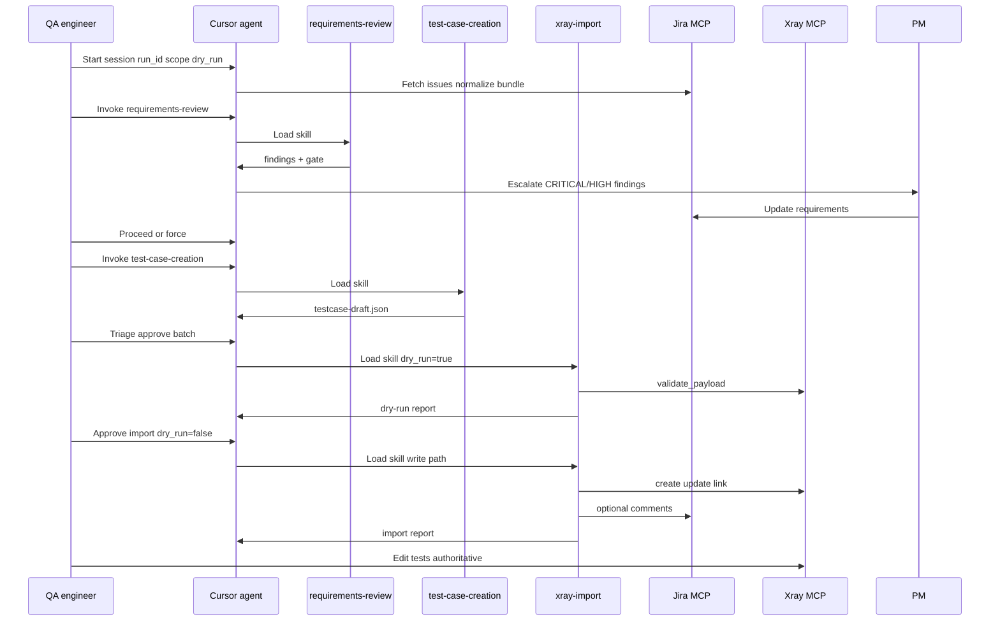

# Agent Skills Specification — AI-assisted test creation

**Status:** Draft for review — **not yet implemented** as Cursor Skill files  
**Date:** 2026-06-09  
**Purpose:** Define in detail what each of the three Agent Skills will do, how they operate, and how they connect to MCP, templates, and human gates. After review and corrections, this document will be used to author the actual `SKILL.md` files.

**Related documents:**

- [ai_test_creation.md](../ai_test_creation.md) — end-to-end operational plan (Phases A–K)
- [08 - Cursor Agent Skills.md](../08%20-%20Cursor%20Agent%20Skills.md) — Epic 08 delivery acceptance criteria
- [07 - Configuration schema and repository layout.md](../07%20-%20Configuration%20schema%20and%20repository%20layout.md) — schemas, mapping, repo layout
- [requirements-template.md](../requirements-template.md) — canonical requirement bundle shape
- [06 - MCP integration platform.md](../06%20-%20MCP%20integration%20platform.md) — MCP tool surface

---

## Table of contents

1. [Overview](#1-overview)
2. [Shared concepts](#2-shared-concepts)
3. [Skill 1: requirements-review](#3-skill-1-requirements-review)
4. [Skill 2: test-case-creation](#4-skill-2-test-case-creation)
5. [Skill 3: xray-import](#5-skill-3-xray-import)
6. [How the three skills work together](#6-how-the-three-skills-work-together)
7. [Repository layout (planned)](#7-repository-layout-planned)
8. [Open decisions for your corrections](#8-open-decisions-for-your-corrections)
9. [Implementation checklist (after approval)](#9-implementation-checklist-after-approval)

---

## 1. Overview

### 1.1 What these skills are

Three **Cursor Agent Skills** encode the team’s standards for LLM-assisted test creation. Each skill is a directory under `.cursor/skills/` containing a `SKILL.md` file (and optional supporting files). When invoked, the skill instructs the agent how to behave: which files to read, which MCP tools to call, what outputs to produce, when to stop for humans, and how to handle errors.

Skills are **not** standalone scripts or MCP servers. They are **behavior specifications** that the Cursor agent follows during a session. External system access happens exclusively through **MCP tools** (Jira, optional Figma, Xray).

### 1.2 The three skills at a glance

| Skill directory | Purpose | Primary actor after skill runs |
|-----------------|---------|--------------------------------|
| `requirements-review` | Analyze Jira requirements against team standards; surface gaps with severities; gate test generation | **PM** addresses findings; **QA** decides whether to proceed |
| `test-case-creation` | Generate `TestCaseDraft` JSON from approved requirements + golden style baseline | **QA** triages drafts before import |
| `xray-import` | Validate drafts, dry-run or write to Xray, link requirements, optional Test Execution | **QA** edits authoritative tests in Xray |

### 1.3 Design principles

1. **Human gates are mandatory** — Skills never skip PM review (requirements) or QA approval (tests/import).
2. **Traceability by default** — Every test must reference at least one Jira requirement key; import rejects otherwise.
3. **Do not invent requirements** — Test steps must derive from acceptance criteria, description, or explicitly cited requirement text.
4. **Sandbox first** — Default target is sandbox Xray; production writes require explicit policy flag.
5. **Audit trail** — Every skill output includes `run_id` and references schema/mapping versions.
6. **Fail clearly** — Structured errors, not silent omission of fields or keys.
7. **Idempotent where possible** — Re-runs should update existing Xray tests when fingerprint matches, not duplicate blindly.

---

## 2. Shared concepts

### 2.1 Session parameters

Every skill run assumes these parameters are set at session start (Phase B in [ai_test_creation.md](../ai_test_creation.md)):

| Parameter | Required | Description |
|-----------|----------|-------------|
| `run_id` | Yes | UUID or timestamp; echoed in all artifacts, comments, fingerprints |
| `scope` | Yes | Epic key, Story key(s), or approved JQL |
| `dry_run` | Yes (for import) | `true` = validate only, no Xray writes; `false` = execute import |
| `environment` | Yes | `sandbox` (default) or `production` (allowlisted only) |
| `golden_version` | Recommended | e.g. `golden/v1` — which golden examples to load |
| `bundle_version` | Recommended | Version of requirement bundle if pre-extracted |
| `force` | No | QA override to proceed past CRITICAL requirement findings (documented exception) |

### 2.2 Requirement bundle (input shape)

Skills consume a **normalized requirement bundle** — one record per Epic or Story. The normative template is [requirements-template.md](../requirements-template.md) (YAML or equivalent markdown headings).

Minimum fields the skills rely on:

| Field / section | Used by |
|-----------------|---------|
| `work_item.jira_key` | All three skills |
| `summary`, `description` | Review, creation |
| `acceptance_criteria.items[]` | Review, creation (primary test source) |
| `scope.in_scope` / `scope.out_of_scope` | Review, creation (reduce hallucination) |
| `testability` (environments, data, APIs, UI) | Creation |
| `traceability.design_references` | Creation (design-linked tests) |
| `open_questions[]` with `blocking` | Review (gate logic) |
| `document.redaction_applied` | All (must be true before LLM if sensitive data stripped) |

**Phase 0 manual path:** bundle may be supplied as files without Jira MCP. **Phase 1 automated path:** agent builds bundle via Jira MCP (Phase C) before invoking Skill 1 or 2.

### 2.3 TestCaseDraft (intermediate output)

Skill 2 produces and Skill 3 consumes an array of **TestCaseDraft** objects. Schema lives at `schemas/TestCaseDraft.schema.json` (Epic 07 — to be created).

Required fields (from [ai_test_creation.md](../ai_test_creation.md) §7):

```json
{
  "title": "string (min 8 chars)",
  "linked_requirement_keys": ["PROJ-123"],
  "steps": [
    {
      "step": "Action the tester performs",
      "expected_result": "Observable outcome",
      "test_data": "optional"
    }
  ]
}
```

Optional fields: `objective`, `preconditions`, `test_type`, `priority`, `tags`, `covers_design`, `design_references`.

Each batch artifact should also include:

```json
{
  "schema_version": "1.0",
  "run_id": "...",
  "generated_at": "ISO-8601",
  "source_requirement_keys": ["PROJ-123"],
  "tests": [ /* TestCaseDraft[] */ ]
}
```

### 2.4 Configuration files (Epic 07 — referenced by skills)

| File | Purpose |
|------|---------|
| `config/jira_xray_mapping.yaml` | Jira field IDs, Xray project, folders, link types, custom fields, sandbox vs prod targets |
| `templates/requirement_standard.md` | Checklist criteria for requirements review |
| `templates/review_findings.schema.json` | Structured output for Skill 1 |
| `schemas/TestCaseDraft.schema.json` | Validation for Skill 2 output and Skill 3 input |
| `golden/v1/` | Approved example tests + `style-rules.md` |

### 2.5 MCP tools (logical names)

Skills call MCP tools; exact names may differ per server implementation. Logical minimum:

**Jira:** `jira_get_issue`, `jira_search`, `jira_get_issue_links`, `jira_add_comment`, `jira_get_attachment_metadata`

**Figma (optional):** `figma_get_file_metadata`, `figma_export_node` / `figma_get_image`, `figma_get_comments`

**Xray:** `xray_search_tests`, `xray_create_or_update_test`, `xray_link_requirement`, `xray_add_test_to_folder_or_test_set`, `xray_create_test_execution`, `xray_add_tests_to_execution`, `xray_validate_payload`

### 2.6 Severity model (Skill 1)

| Severity | Meaning | Default gate behavior |
|----------|---------|----------------------|
| **CRITICAL** | Missing or untestable AC; blocking open question; scope contradiction; data/security gap that prevents meaningful tests | **Blocks** test generation unless `force=true` with QA acknowledgment |
| **HIGH** | Ambiguous AC; missing testability info; incomplete traceability | Warn; QA/PM should resolve before generation (soft block — skill may proceed with explicit warnings listed) |
| **MEDIUM** | Style/template deviation; minor clarity issue | Report only; does not block |
| **LOW** | Suggestion; nice-to-have AC improvement | Report only |

> **For your correction:** Confirm whether HIGH should hard-block like CRITICAL, or only CRITICAL blocks.

### 2.7 Finding categories (Skill 1)

Proposed taxonomy for structured findings:

| Category | Examples |
|----------|----------|
| `acceptance_criteria` | Missing AC, non-testable AC, duplicate AC, AC contradicts description |
| `scope` | In/out scope unclear or conflicting |
| `testability` | No environment, no test data, API path missing, UI screen unnamed |
| `traceability` | No design link when UI feature; parent Epic missing |
| `open_questions` | Blocking question unresolved |
| `template_compliance` | Required section empty or N/A without reason |
| `data_sensitivity` | Possible PII/secrets in text (flag for redaction) |

---

## 3. Skill 1: requirements-review

### 3.1 Purpose

Run a **structured quality analysis** of one or more Jira requirements **before** test case generation. The skill compares each requirement record against `templates/requirement_standard.md`, produces actionable findings for PM, and enforces a **gate** that prevents wasted LLM effort on incomplete specs.

This skill operationalizes **Phase E** in [ai_test_creation.md](../ai_test_creation.md).

### 3.2 When to invoke

**Explicit triggers (user or orchestrating workflow):**

- “Review requirements for PROJ-123”
- “Run requirements-review on Epic PROJ-100”
- “Review-only pass for JQL: project = PROJ AND sprint = 42”
- Review step in full automated workflow (Epic 09) **before** test-case-creation

**Do not invoke when:**

- User only wants test drafts and requirements were already reviewed in this session with same bundle version
- Bundle is empty or scope unresolved

**Recommended:** `disable-model-invocation: true` in SKILL.md frontmatter so the skill loads only when explicitly requested.

### 3.3 Inputs

| Input | Source | Required |
|-------|--------|----------|
| Requirement bundle(s) | Pre-built YAML/MD files **or** built live via Jira MCP (Phase C) | Yes |
| `run_id` | Session parameter | Yes |
| `templates/requirement_standard.md` | Repo | Yes |
| `config/jira_xray_mapping.yaml` | Repo (field list for Jira fetch) | Yes if fetching from Jira |
| `scope` | Epic / Story keys / JQL | Yes |

### 3.4 Operational steps (agent behavior)

The skill instructs the agent to execute these steps in order:

#### Step 1 — Pre-flight

1. Confirm `run_id` is set; if not, generate one and announce it.
2. Verify Jira MCP connectivity if bundle will be fetched live (trivial `jira_get_issue` on a known key).
3. Load `templates/requirement_standard.md` and `templates/review_findings.schema.json`.
4. Load redaction rules from mapping config or governance doc; confirm bundle has `redaction_applied: true` if required.

#### Step 2 — Acquire requirement data

**Path A — Live fetch (Phase 1):**

1. Resolve scope: Epic → child Stories (per mapping link type); JQL → paginated search with limit.
2. For each issue: `jira_get_issue` with field list from mapping; `jira_get_issue_links`.
3. Normalize each issue to requirement bundle shape (align with [requirements-template.md](../requirements-template.md)).
4. Apply redaction before any LLM analysis.
5. Present summary table to user: `jira_key | summary | AC count | blocking OQ count`.

**Path B — Pre-supplied bundle (Phase 0 or re-review):**

1. Read bundle file(s) from path user provides or from session artifact.
2. Validate structure; flag missing required sections.
3. Optionally refresh from Jira if user requests (`--refresh` equivalent).

#### Step 3 — Analyze each requirement

For **each** `jira_key` in scope, the agent:

1. Walks every criterion in `requirement_standard.md` (checklist-driven).
2. Evaluates `acceptance_criteria` items for atomicity and testability (“Given/When/Then” or checklist — per org standard).
3. Checks `scope`, `testability`, `open_questions`, `traceability` sections.
4. For each gap, emits one **finding** with:

| Field | Description |
|-------|-------------|
| `finding_id` | Stable id within run, e.g. `RR-PROJ-456-01` |
| `jira_key` | Affected requirement |
| `severity` | CRITICAL / HIGH / MEDIUM / LOW |
| `category` | From taxonomy §2.7 |
| `excerpt_quote` | **Verbatim** quote from requirement text (proves grounding) |
| `finding_summary` | One-line description |
| `question_for_PM` | Actionable question (empty if N/A) |
| `suggested_AC_patch` | Proposed AC text (empty if N/A) |
| `blocks_test_generation` | Boolean — true for CRITICAL by default |

**Rules the skill must enforce:**

- Every finding with a quote must cite **actual text** from the bundle — no paraphrase presented as quote.
- Do not invent missing product behavior to fill gaps; ask PM instead.
- If `open_questions[].blocking == true` and unanswered → CRITICAL finding.
- If all AC items marked `testable: false` or AC section empty → CRITICAL.

#### Step 4 — Rollup summary (multi-story / Epic scope)

If scope contains multiple stories:

1. Common gap patterns (e.g. “3/5 stories missing test data”).
2. Cross-story dependencies from `dependencies` section.
3. Epic-level `blocks_test_generation` count.
4. Recommended order for PM fixes.

#### Step 5 — Produce outputs

Write **two** artifacts:

**A. Human-readable markdown** — `artifacts/{run_id}/requirements-review.md`

Sections: Executive summary, per-key findings table, rollup, gate status, next actions for PM/QA.

**B. Machine-readable JSON** — `artifacts/{run_id}/requirements-review.json`

Conforms to `templates/review_findings.schema.json`:

```json
{
  "run_id": "...",
  "reviewed_at": "ISO-8601",
  "scope": { "type": "epic|story|jql", "value": "..." },
  "requirement_keys": ["PROJ-456"],
  "findings": [ /* finding objects */ ],
  "gate": {
    "status": "PASS | PASS_WITH_WARNINGS | BLOCKED",
    "critical_unresolved_count": 0,
    "blocks_test_generation": false
  },
  "schema_version": "1.0"
}
```

#### Step 6 — Gate decision

| Condition | Gate status | Agent action |
|-----------|-------------|--------------|
| Zero CRITICAL findings | PASS or PASS_WITH_WARNINGS | Inform QA they may proceed to test-case-creation |
| CRITICAL findings exist, `force` not set | BLOCKED | **Stop.** Do not invoke test-case-creation. List CRITICAL items. |
| CRITICAL findings exist, `force=true` with QA confirmation | PASS_WITH_WARNINGS (forced) | Log override in artifact; proceed only if QA explicitly confirms in chat |

#### Step 7 — Optional Jira comment

If policy allows and user opts in:

- `jira_add_comment` on Epic or each Story with short summary: finding counts, gate status, `run_id`, link to full artifact path.
- Never paste full sensitive content into Jira if governance forbids.

### 3.5 Outputs summary

| Output | Consumer |
|--------|----------|
| `requirements-review.md` | QA, PM |
| `requirements-review.json` | Workflow orchestration, metrics |
| Gate status in chat | QA (proceed/stop decision) |
| Optional Jira comment | PM, audit |

### 3.6 Failure modes

| Failure | Skill behavior |
|---------|----------------|
| Jira MCP unreachable | Abort; report connectivity fix steps |
| Issue not found / no permission | Structured error per key; continue other keys if batch |
| Empty AC and empty description | Single CRITICAL finding; BLOCKED |
| Mapping field wrong (empty fetch) | Report field ID issue; suggest mapping fix |
| Bundle schema invalid | List validation errors; abort review |

### 3.7 What this skill does NOT do

- Does not generate test cases
- Does not write to Xray
- Does not modify Jira issues (read + optional comment only)
- Does not auto-fix requirements — suggests patches for PM to apply

### 3.8 Planned SKILL.md frontmatter (draft)

```yaml
---
name: requirements-review
description: >-
  Analyzes Jira requirements against team standards and produces structured
  findings with severities for PM. Gates test generation on CRITICAL gaps.
  Use when reviewing Epics/Stories before test creation, or when the user
  asks for requirement quality review, AC gaps, or review-only pass.
disable-model-invocation: true
---
```

### 3.9 Supporting files (planned)

| File | Content |
|------|---------|
| `reference.md` | Full checklist mirrored from requirement_standard.md; edge case examples |
| `examples.md` | Sample input bundle + expected findings output |

---

## 4. Skill 2: test-case-creation

### 4.1 Purpose

Generate **TestCaseDraft** JSON from **approved** requirement context, styled to match the **golden test case library**. The skill maps acceptance criteria to tests, adds negative/edge cases per policy, checks coverage, and optionally flags duplicates against existing Xray tests.

This skill operationalizes **Phase F** and part of **Phase G** (schema validation) in [ai_test_creation.md](../ai_test_creation.md).

### 4.2 When to invoke

**Explicit triggers:**

- “Generate tests for PROJ-456” (after requirements review passed)
- “Run test-case-creation using bundle v1.0 and golden v1”
- “Create TestCaseDraft for Epic PROJ-100”
- Orchestrated step after PM gate in Epic 09 workflow

** Preconditions (skill must verify):**

1. Requirement bundle available (file or fetched).
2. Requirements-review gate is **PASS** or **PASS_WITH_WARNINGS** for this scope and bundle version — OR `force` override documented.
3. If review artifact exists, agent reads `requirements-review.json` and confirms `gate.blocks_test_generation == false` (unless forced).

**Do not invoke when:**

- Gate is BLOCKED without force
- User requests import-only (use xray-import)

### 4.3 Inputs

| Input | Source | Required |
|-------|--------|----------|
| Requirement bundle(s) | Same as Skill 1 | Yes |
| `golden/{version}/` | Repo — example tests + `style-rules.md` | Yes |
| `schemas/TestCaseDraft.schema.json` | Repo | Yes |
| `run_id` | Session | Yes |
| `requirements-review.json` | Prior skill output | Recommended |
| Figma context | MCP export or links in bundle | Optional |
| `config/jira_xray_mapping.yaml` | For Xray dedup search | Optional |

### 4.4 Operational steps (agent behavior)

#### Step 1 — Pre-flight

1. Confirm gate status (read review artifact or ask QA to confirm review completed).
2. Load `golden/{version}/` — include **2–5 representative examples** in context (not entire library if large); always load `style-rules.md`.
3. Load TestCaseDraft schema.
4. Confirm redaction applied on bundle.

#### Step 2 — Optional Figma enrichment (Phase D)

Only if policy allows **and** requirement has design references:

| Policy | Behavior |
|--------|----------|
| Link-only | Copy Figma URLs into `design_references`; no image export |
| Export allowed | Call Figma MCP for named frames; attach to generation context for those requirements only |
| Figma out of scope | Skip; use Jira-stored links only |

If many frames: **stop and ask QA** which screens apply to this run.

#### Step 3 — Build generation plan (per requirement)

For each `jira_key`:

1. List AC items with ids (`AC-01`, …).
2. Identify testability fixtures, APIs, UI screens.
3. Plan test count: typically **≥1 test per must-have AC** + negatives per policy.
4. Announce plan briefly in chat before generating (optional but recommended for transparency).

#### Step 4 — Generate TestCaseDraft candidates

**Core rules (non-negotiable in SKILL.md):**

1. **AC-first** — Each test traces to at least one AC id or explicit requirement quote in `linked_requirement_keys` / internal metadata.
2. **Do not invent requirements** — If AC is insufficient, emit a **warning** in coverage report, not a fabricated scenario.
3. **Golden alignment** — Match step granularity, expected result phrasing, priority usage, naming patterns from `style-rules.md`.
4. **Every test** has non-empty `linked_requirement_keys` matching pattern `^[A-Z][A-Z0-9]+-[0-9]+$`.
5. **Steps** — Each step has `step` + `expected_result`; no vague “verify it works”.
6. **Negative / edge tests** — Per policy table (errors, permissions, empty states, boundary values).
7. **Design coverage** — If UI screens in testability, at least one test references `covers_design: true` when AC implies UI validation.

**Suggested test metadata (optional fields in draft):**

```json
{
  "linked_ac_ids": ["AC-01"],
  "source_quotes": ["Given a logged-in customer..."],
  "generation_notes": "Edge case for decline code A1 per constraints.business_rules"
}
```

> **For your correction:** Confirm whether `linked_ac_ids` should be required in schema or optional metadata.

#### Step 5 — Coverage pass

After generation, produce **coverage matrix**:

| AC id | Covered by test title(s) | Status |
|-------|--------------------------|--------|
| AC-01 | “Successful checkout under contactless limit” | Covered |
| AC-02 | — | **UNCOVERED** |

List **UNCOVERED** items as warnings in artifact; do not silently skip.

#### Step 6 — De-duplication hint (optional MCP)

If Xray MCP available:

1. For each candidate title (or fingerprint prefix), call `xray_search_tests`.
2. Flag `possible_duplicate_of: "TEST-123"` in draft metadata.
3. Do **not** skip creation automatically — QA decides at import.

#### Step 7 — Schema and policy validation (Phase G partial)

Before presenting output:

1. Validate every test against `TestCaseDraft.schema.json`.
2. Traceability check: all `linked_requirement_keys` exist in current bundle scope (or approved superset).
3. Policy checks from `golden/style-rules.md`: max steps, forbidden words, required precondition patterns.

If validation fails: fix and re-validate **or** report unfixable items with explicit errors.

#### Step 8 — Produce outputs

**A. JSON batch file** — `artifacts/{run_id}/testcase-draft.json`

```json
{
  "schema_version": "1.0",
  "run_id": "...",
  "generated_at": "ISO-8601",
  "golden_version": "golden/v1",
  "source_requirement_keys": ["PROJ-456"],
  "coverage_report": { "uncovered_ac_ids": [], "warnings": [] },
  "tests": [ /* TestCaseDraft[] */ ]
}
```

**B. Human-readable summary** — `artifacts/{run_id}/testcase-draft.md`

Table: test title | linked keys | AC ids | priority | duplicate hint.

**C. Chat summary** — Count of tests, uncovered ACs, validation status.

#### Step 9 — QA triage checkpoint

Skill **stops** after output. QA:

- Drops bad tests
- Requests regeneration for specific keys (“regenerate only AC-03 scenarios for PROJ-456”)
- Approves batch for validation/import

Skill does **not** auto-invoke xray-import.

### 4.5 Outputs summary

| Output | Consumer |
|--------|----------|
| `testcase-draft.json` | xray-import skill, QA, metrics |
| `testcase-draft.md` | QA quick review |
| Coverage report | QA, PM (uncovered ACs) |

### 4.6 Failure modes

| Failure | Skill behavior |
|---------|----------------|
| Gate BLOCKED | Refuse to run; point to requirements-review artifact |
| Golden path missing | Abort with setup instructions |
| Schema validation fails after retry | Output errors per test; do not claim success |
| LLM drift / invented steps | Skill instructs self-check: every expected result must map to AC quote; flag suspect tests in `warnings` |
| Figma MCP fails | Degrade to link-only; log warning |

### 4.7 Model / prompting guidance (for SKILL.md)

Document org-specific guidance (placeholders until governance confirms):

- Prefer **lower temperature** for factual step generation.
- Include explicit system rule: “If acceptance criteria do not specify behavior X, do not test behavior X.”
- Cite AC ids in generation notes for audit.
- Do not include secrets or production credentials in test data — use placeholders from `testability.data.fixtures`.

### 4.8 What this skill does NOT do

- Does not import to Xray (Skill 3)
- Does not post Jira comments (unless separate orchestration step)
- Does not replace QA review
- Does not modify requirements in Jira

### 4.9 Planned SKILL.md frontmatter (draft)

```yaml
---
name: test-case-creation
description: >-
  Generates TestCaseDraft JSON from approved Jira requirements using golden
  test style rules. Maps ACs to tests, reports coverage gaps, validates against
  schema. Use after requirements review passes, or when user asks to draft
  test cases from Stories/Epics.
disable-model-invocation: true
---
```

### 4.10 Supporting files (planned)

| File | Content |
|------|---------|
| `reference.md` | Negative test policy table, priority rules, naming conventions |
| `examples.md` | Sample requirement → TestCaseDraft transformation |

---

## 5. Skill 3: xray-import

### 5.1 Purpose

Take **validated TestCaseDraft[]**, map them to Xray’s API shape via `jira_xray_mapping.yaml`, and **dry-run or execute** create/update in Xray with **requirement linkage**, taxonomy placement, optional **Test Execution** scaffold, and Jira back-comments.

This skill operationalizes **Phase G** (Xray dry-run), **Phase I**, and optional **Phase J** in [ai_test_creation.md](../ai_test_creation.md).

### 5.2 When to invoke

**Explicit triggers:**

- “Import tests to Xray (dry run)” with `dry_run=true`
- “Import approved batch to sandbox Xray” with `dry_run=false`
- “Run xray-import on artifacts/{run_id}/testcase-draft.json”
- After QA approves validation report in full workflow

** Preconditions:**

1. Input JSON validates against TestCaseDraft schema.
2. QA explicit approval to import (chat confirmation or `--approved` flag in orchestration).
3. `config/jira_xray_mapping.yaml` present and matches environment.
4. `dry_run` explicitly stated.

### 5.3 Inputs

| Input | Source | Required |
|-------|--------|----------|
| `testcase-draft.json` | Skill 2 output or hand-edited file | Yes |
| `config/jira_xray_mapping.yaml` | Repo | Yes |
| `run_id` | Session | Yes |
| `dry_run` | Session parameter | Yes |
| `environment` | `sandbox` (default) or `production` | Yes |
| QA approval | Human confirmation | Yes if `dry_run=false` |
| Test Execution params | Optional: name pattern, build/version | No |

### 5.4 Operational steps (agent behavior)

#### Step 1 — Pre-flight checks

1. Load mapping file; verify `environment` matches allowed targets (`sandbox` default).
2. If `environment=production`: confirm project key is in mapping allowlist; **abort** if not.
3. Validate input JSON against schema.
4. Verify Xray MCP connectivity (`xray_search_tests` trivial query or health check).
5. Confirm `dry_run` value announced to user.

#### Step 2 — Map TestCaseDraft → Xray payload

For each test, transform using mapping rules:

| TestCaseDraft field | Xray field (via mapping) |
|---------------------|--------------------------|
| `title` | Test summary / name |
| `steps[]` | Xray manual steps structure |
| `priority` | Xray priority field |
| `test_type` | Xray test type |
| `preconditions` | Preconditions field or first step note |
| `linked_requirement_keys` | Requirement coverage links |
| `tags` | Labels/components per mapping |
| Fingerprint (computed) | Custom field if configured |

**Fingerprint computation (draft rule):**

```
SHA256(normalized_requirement_text_snapshot + skill_version + schema_version)[:16]
```

Stored in agreed custom field for idempotency. Exact algorithm **subject to Epic 02/07 confirmation**.

#### Step 3 — Upsert decision (per test)

1. Call `xray_search_tests` by fingerprint field **or** title + requirement key combo.
2. If match found:
   - **Dry-run:** report `action: would_update`, existing `xray_key`
   - **Write:** prompt QA for confirmation on updates (configurable: auto-update vs confirm-each)
3. If no match:
   - **Dry-run:** report `action: would_create`
   - **Write:** create via `xray_create_or_update_test`

> **For your correction:** Confirm update policy — always prompt QA vs auto-update on fingerprint match.

#### Step 4 — Dry-run path (`dry_run=true`)

1. Call `xray_validate_payload` for each test **or** use MCP global write-disable flag.
2. Collect normalization result and validation errors.
3. **No writes** to Xray.
4. Produce report (Step 7) with `mode: dry_run`.

#### Step 5 — Write path (`dry_run=false`)

Requires QA approval recorded in session log.

Per test, in order:

1. `xray_create_or_update_test`
2. `xray_link_requirement` for each key in `linked_requirement_keys`
3. `xray_add_test_to_folder_or_test_set` per mapping defaults or per-story rules

**Partial failure policy (default):**

| Setting | Behavior |
|---------|----------|
| `on_error: continue` (default) | Log failure; continue remaining tests; summary shows successes + failures |
| `on_error: stop` | Abort batch on first write failure |

> **For your correction:** Confirm default partial failure behavior.

#### Step 6 — Optional Test Execution (Phase J)

If user enables `create_test_execution=true`:

1. Confirm naming pattern from mapping, e.g. `TE — {story_key} — {run_id}`.
2. `xray_create_test_execution` with build/version/environment from parameters.
3. `xray_add_tests_to_execution` for all tests created/updated in this run for that scope.
4. Record TE key in import report.

If TE not needed: skip with logged waiver.

#### Step 7 — Post-import verification

For successful writes (sample at least 1, or all if batch ≤5):

1. Read back test via Xray MCP or API.
2. Verify requirement links resolve in Xray UI semantics.
3. Record `xray_key` in results table.

#### Step 8 — Jira back-comments (optional)

If policy allows:

- `jira_add_comment` on each linked Story with: Xray test keys created/updated, `run_id`, optional TE key.
- Use approved comment template from mapping config.

#### Step 9 — Produce outputs

**Import report JSON** — `artifacts/{run_id}/xray-import-report.json`

```json
{
  "run_id": "...",
  "mode": "dry_run | write",
  "environment": "sandbox",
  "mapping_version": "1.0",
  "started_at": "...",
  "completed_at": "...",
  "results": [
    {
      "draft_title": "...",
      "linked_requirement_keys": ["PROJ-456"],
      "action": "create | update | would_create | would_update | failed",
      "xray_key": "TEST-789",
      "errors": []
    }
  ],
  "test_execution_key": "TE-100",
  "summary": {
    "total": 5,
    "created": 3,
    "updated": 1,
    "failed": 1
  }
}
```

**Human-readable** — `artifacts/{run_id}/xray-import-report.md`

### 5.5 QA handoff modes (org policy — affects when Skill 3 runs)

The skill supports three handoff policies (Epic 09 — **decision pending**):

| Mode | When Skill 3 runs | Xray target |
|------|-------------------|-------------|
| **A — Staging first** | After Skill 2 + schema validation; QA edits in staging folder | Staging folder/Test Set from mapping |
| **B — Draft labels** | After Skill 2; import with draft label/status | Production or sandbox folder with draft marker |
| **C — Local-only first** | After QA edits `testcase-draft.json` locally post Skill 2 | Final folder on import |

Skill 3 reads `handoff_mode` from mapping config and selects target folder/labels accordingly.

### 5.6 Outputs summary

| Output | Consumer |
|--------|----------|
| `xray-import-report.json` | Metrics, audit, rerun decisions |
| `xray-import-report.md` | QA, operators |
| Xray Tests | Authoritative test repository (post QA edit) |
| Optional Jira comments | PM, dev, audit |
| Optional Test Execution | Manual/CI test runs later |

### 5.7 Failure modes

| Failure | Skill behavior |
|---------|----------------|
| Mapping file missing/invalid | Abort before any MCP write |
| Schema validation fails | Abort; list test indices and errors |
| Xray 400 on create | Capture response; mapping mismatch hints; continue or stop per policy |
| MCP 401/403 | Abort batch; auth troubleshooting steps |
| Production without allowlist | Hard abort |
| Requirement link fails after test created | Record partial success; list keys needing manual link fix |
| Duplicate without fingerprint | Warn; create duplicate unless QA chose update path |

### 5.8 What this skill does NOT do

- Does not generate tests (Skill 2)
- Does not review requirements (Skill 1)
- Does not replace QA editing tests in Xray after import
- Does not execute tests (only TE scaffold creation)

### 5.9 Planned SKILL.md frontmatter (draft)

```yaml
---
name: xray-import
description: >-
  Validates TestCaseDraft JSON and imports or dry-runs tests into Xray with
  requirement linkage and optional Test Execution. Use when user approves
  test batch for Xray import, sandbox or production dry-run, or upsert
  with idempotency fingerprint.
disable-model-invocation: true
---
```

### 5.10 Supporting files (planned)

| File | Content |
|------|---------|
| `reference.md` | MCP call order, field mapping examples, TE naming |
| `examples.md` | Sample draft JSON → Xray payload → report |

---

## 6. How the three skills work together

### 6.1 Typical full session sequence



### 6.2 Standalone usage

Each skill can run **independently**:

| Skill | Standalone use case |
|-------|---------------------|
| requirements-review | PM/QA quality gate on specs mid-sprint |
| test-case-creation | Draft from pre-built bundle (Phase 0 manual path) |
| xray-import | Import hand-crafted JSON; re-import after QA edits |

### 6.3 Artifact trail (audit)

All artifacts for a session live under `artifacts/{run_id}/`:

```
artifacts/{run_id}/
├── requirements-review.json
├── requirements-review.md
├── testcase-draft.json
├── testcase-draft.md
├── xray-import-report.json
└── xray-import-report.md
```

Epic 09 also specifies a session **artifact index** file listing outputs for KPI and audit.

### 6.4 Skill dependency matrix

| Skill | Depends on | Blocks |
|-------|------------|--------|
| requirements-review | Bundle, requirement_standard | test-case-creation (if BLOCKED) |
| test-case-creation | Bundle, golden, passed gate | xray-import (QA approval) |
| xray-import | testcase-draft.json, mapping, MCP | — |

---

## 7. Repository layout (planned)

After implementation, the test-creation repo will contain:

```
.
├── .cursor/
│   └── skills/
│       ├── requirements-review/
│       │   ├── SKILL.md
│       │   ├── reference.md
│       │   └── examples.md
│       ├── test-case-creation/
│       │   ├── SKILL.md
│       │   ├── reference.md
│       │   └── examples.md
│       └── xray-import/
│           ├── SKILL.md
│           ├── reference.md
│           └── examples.md
├── config/
│   └── jira_xray_mapping.yaml
├── templates/
│   ├── requirement_standard.md
│   └── review_findings.schema.json
├── schemas/
│   └── TestCaseDraft.schema.json
├── golden/
│   └── v1/
│       ├── style-rules.md
│       └── examples/
├── artifacts/                  # gitignored — session outputs
│   └── {run_id}/
└── docs/                       # optional — link to AI in QA folder
```

**Note:** Skills may live in the **project repo** used for QA workflows (`.cursor/skills/`) rather than in this DOCS repo. Confirm target repository during implementation.

---

## 8. Open decisions for your corrections

Please mark up or reply with decisions on these items before we author `SKILL.md` files:

| # | Decision | Options | Current draft default |
|---|----------|---------|----------------------|
| 1 | Gate severity | CRITICAL only blocks vs CRITICAL+HIGH block | CRITICAL only |
| 2 | QA handoff mode | Staging / draft labels / local-only first | **TBD** — Skill 3 reads config |
| 3 | Xray update on fingerprint match | Auto-update vs confirm each with QA | Confirm with QA |
| 4 | Partial import failure | Continue vs stop on first error | Continue |
| 5 | Figma policy | Link-only / export / out of scope | Link-only until decided |
| 6 | Test Execution in v1 | Default on / off / opt-in per session | Opt-in per session |
| 7 | `linked_ac_ids` in TestCaseDraft | Required vs optional metadata | Optional metadata |
| 8 | Target repo for `.cursor/skills/` | This DOCS repo vs dedicated QA tooling repo | **TBD** |
| 9 | HIGH finding soft-block | Proceed with warnings vs require PM acknowledgment | Proceed with warnings |
| 10 | Jira comment policy | Always / opt-in / never on customer projects | Opt-in |
| 11 | Fingerprint algorithm | Exact hash inputs and field for storage | See §5.4 Step 2 |
| 12 | Production import | Separate skill flag vs mapping allowlist only | Mapping allowlist + explicit env |

---

## 9. Implementation checklist (after approval)

Once you approve this specification (with corrections):

- [ ] Create `templates/requirement_standard.md` (if not exists)
- [ ] Create `templates/review_findings.schema.json`
- [ ] Create `schemas/TestCaseDraft.schema.json`
- [ ] Create `config/jira_xray_mapping.yaml` stub with sandbox placeholders
- [ ] Populate `golden/v1/` from Phase 0 golden library
- [ ] Author `.cursor/skills/requirements-review/SKILL.md`
- [ ] Author `.cursor/skills/test-case-creation/SKILL.md`
- [ ] Author `.cursor/skills/xray-import/SKILL.md`
- [ ] Add `reference.md` and `examples.md` per skill
- [ ] Sandbox demo: Skill 1 on ≥1 pilot key (Epic 08 AC)
- [ ] Sandbox demo: Skill 2 on ≥2 requirements (Epic 08 AC)
- [ ] Sandbox demo: Skill 3 import ≥1 test with link (Epic 08 AC)
- [ ] Wire into Epic 09 orchestration runbook

---

*This is a living specification. After your corrections, the next step is to implement the three `SKILL.md` files following [Cursor Skill conventions](https://cursor.com/docs) and the create-skill guidance.*
