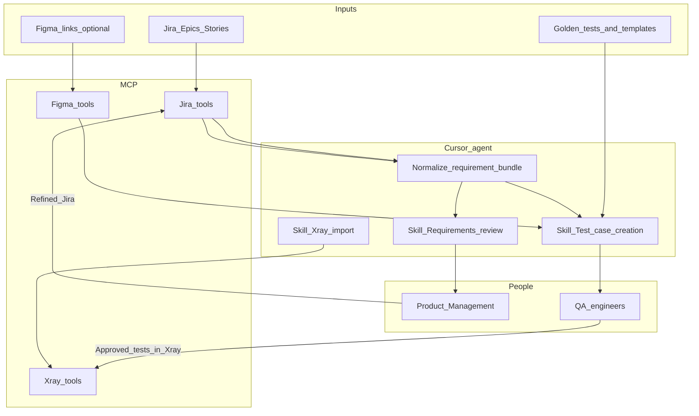

# AI-assisted test creation — end-to-end plan (Cursor, MCP, and Agent Skills)

This document is the **single operational plan** for introducing an **LLM-assisted** workflow that starts from **Jira** requirements, optionally uses **Figma** design context, produces **test scenarios**, supports **QA review and correction**, and ends with **Xray** import including **requirement linkage** and, where appropriate, a **Test Execution** that groups the new tests. **Version 1** assumes the workflow is **run from Cursor** with **MCP servers** for external systems and **Cursor Agent Skills** that encode team standards.

---

## Document control

| Version | Date | Author | Notes |
|---------|------|--------|--------|
| 0.1 | 2026-04-08 | Marek Wyszyński | Initial E2E plan (Cursor / MCP / Skills). |

---

## 1. High-level solution overview

### 1.1 What problem this solves

Product and Engineering and QA teams need **consistent, traceable test cases** tied to **Jira** work items, without spending a lot of time on repetitive drafting. An LLM-based solution can **accelerate** drafting and **indicate requirement gaps** early, provided that the PMs and QA Engineers will review and approve the output of the LLM.

### 1.2 What the v1 solution is

- **Host environment:** [Cursor](https://cursor.com) (or equivalent IDE with MCP and agent skills).
- **Integrations:** Conversations with **Jira**, **Figma** (optional), and **Xray** happen **only through MCP tools** (no ad-hoc browser copy-paste for those systems during the workflow).
- **Agent behavior:** Three **Skills** guide the agent through:
  1. **Requirements review** (against predetermined standards and templates).
  2. **Test case creation** (aligned with a **golden** example set).
  3. **Xray import** (format validation, requirement links, optional **Test Execution**).
- **Human gates:** PM refinement after requirement review (as needed); **QA review and edits** of tests **before** they are treated as final (typically in **Xray**).

### 1.3 What v1 explicitly is not

- A fully unattended nightly batch (that can be a **later** phase).
- A replacement for QA sign-off or regulatory evidence without your own validation policy.
- A guarantee that off-the-shelf MCP servers exist for every system; **Xray** in particular may require a **custom MCP server** wrapping your Xray edition’s APIs.

### 1.4 End-to-end flow (one screen)



---

## 2. Goals and success criteria

These align with the broader initiative; measurement methods should be agreed with leadership.

| KPI | Implication for this solution |
|-----|--------------------------------|
| **~75% reduction** in time to create new test cases | Cursor session produces a **validated** batch with minimal rework; templates and golden examples reduce iteration. |
| **≥90%** of requirement ambiguities surfaced **before** development | Requirements review Skill runs **early**; structured findings with severities; PM loop tracked in Jira. |
| **100%** traceability tests ↔ requirements | Import Skill **rejects** payloads missing valid Jira keys; Xray stores links per your mapping. |
| **≥50%** of generated tests need **no logic change** after QA | Strong **golden-set** prompting and acceptance-criteria-first extraction; periodic refresh of gold examples from best QA edits. |

---

## 3. Roles and responsibilities

| Role | Responsibility |
|------|----------------|
| **Platform / admin** | MCP server deployment, service accounts, secrets, Cursor MCP config templates (redacted). |
| **PM** | Respond to requirement review findings; keep Epics/Stories within the agreed template. |
| **QA engineer** | Run or supervise Cursor sessions; review and correct tests in Xray; own final quality. |
| **Automation / BP Test Automation** (if applicable) | Consume stable Xray keys and structured exports; not blocking for v1 import. |

---

## 4. Prerequisites

Before the first production-style run, the following must exist.

### 4.1 Jira

- Identified **project(s)** and **issue types** (Epic, Story, etc.).
- Agreed **fields** for acceptance criteria, description, design links, and any NFR blocks.
- **JQL** examples for “ready for requirement review” and “ready for test generation.”
- **Service account** with least privilege: read issues, read links, add comments (optional), read attachments metadata per policy.

### 4.2 Xray

- **Xray edition** documented (Cloud vs Server/Data Center) and which **API** surface is used (REST vs GraphQL).
- **Test** issue type, **folder / Test Set** conventions, and **requirement coverage** linkage model.
- **Custom fields** (if any) for external fingerprint, source prompt version, or requirement keys—decided up front.
- **Sandbox project** for dry-runs.
- **Service account** with permission to create/update Tests, link requirements, create Test Executions, and add Tests to Executions.

### 4.3 Figma (optional)

- Policy for whether **screens** may be sent to the LLM (export vs link-only).
- **File permissions** for the service identity used by Figma MCP.

### 4.4 LLM and data governance

- Approved **model provider** and **region** (if applicable).
- **Data classification** rules: which Jira fields, attachments, and Figma assets are allowed in prompts.
- **Retention** and **logging** policy for chat/session artifacts.

### 4.5 Repository artifacts (recommended)

- **`.cursor/skills/`** — three skill folders (see section 9).
- **`templates/`** — requirement standard, review output template, test JSON schema.
- **`golden/`** — curated example tests approved by QA.
- **`config/`** — `jira_xray_mapping.yaml` (or JSON): project keys, field IDs, folders, link types.

---

## 5. MCP layer — conceptual specification

All Jira, Figma, and Xray operations performed by the agent during the workflow should map to **explicit MCP tools**. Exact tool names will match your server implementation; below is the **minimum logical surface**.

### 5.1 Jira MCP (logical tools)

| Tool | Purpose |
|------|---------|
| `jira_get_issue` | Fetch issue by key (fields, rendered where needed). |
| `jira_search` | Run approved JQL with pagination. |
| `jira_get_issue_links` | Outward/inward links, epics, parent/child where applicable. |
| `jira_add_comment` | Post summary of review/import (optional but recommended). |
| `jira_get_attachment_metadata` | List attachments; **download** only if policy allows. |

### 5.2 Figma MCP (logical tools)

| Tool | Purpose |
|------|---------|
| `figma_get_file_metadata` | Resolve file/frame names and version. |
| `figma_export_node` or `figma_get_image` | Provide visuals for multimodal prompts **if** policy allows. |
| `figma_get_comments` | Optional context for open design questions. |

### 5.3 Xray MCP (logical tools)

| Tool | Purpose |
|------|---------|
| `xray_search_tests` | Find existing tests by summary, key, or fingerprint field. |
| `xray_create_or_update_test` | Idempotent upsert path (implementation-specific). |
| `xray_link_requirement` | Associate Test with Jira requirement issue(s). |
| `xray_add_test_to_folder_or_test_set` | Match your taxonomy. |
| `xray_create_test_execution` | Create execution record for a build/version/sprint context. |
| `xray_add_tests_to_execution` | Attach all tests created in the **current requirement context**. |
| `xray_validate_payload` | **Dry-run**: return normalized payload and validation errors without write (strongly recommended). |

**Note:** If a single tool cannot dry-run, enforce a **configuration flag** on the MCP server that disables writes.

---

## 6. Detailed end-to-end process

The following is the **full procedural breakdown**. Steps are numbered for runbooks and training.

### Phase A — Administrative setup (once per environment)

| Step | Actor | Action | Detail |
|------|--------|--------|--------|
| **A.1** | Platform | Register service accounts | Separate accounts for Jira, Xray, Figma MCP where possible; no shared personal tokens. |
| **A.2** | Platform | Deploy MCP servers | Host or install MCP servers reachable from machines that run Cursor; document base URL or stdio command. |
| **A.3** | Platform | Configure authentication | OAuth, API tokens, or mTLS per org standard; secrets in vault, not in git. |
| **A.4** | QA lead + Platform | Produce mapping file | `config/jira_xray_mapping.yaml`: Jira project keys, Xray project, custom field IDs, default folder/Test Set, link types. |
| **A.5** | QA lead | Approve golden test set | Place files under `golden/`; version tag (e.g. `golden/v1`). |
| **A.6** | PM lead | Approve requirement standard | `templates/requirement_standard.md` + review output schema. |
| **A.7** | Platform | Publish Cursor MCP snippet | Example `mcp.json` fragment with placeholders; **never** commit secrets. |
| **A.8** | Security | Sign off data policy | Written approval for LLM use of Jira/Figma content at defined sensitivity. |

---

### Phase B — Session initialization (each Cursor session or each “run”)

| Step | Actor | Action | Detail |
|------|--------|--------|--------|
| **B.1** | QA engineer | Open Cursor in the repo | Repo contains Skills, templates, golden tests, and mapping config. |
| **B.2** | QA engineer | Confirm MCP connectivity | Use a trivial call (e.g. `jira_get_issue` on a known test ticket) to verify auth. |
| **B.3** | QA engineer | State run parameters | Provide: Jira Epic key **or** Story keys **or** JQL; optional sprint/build label for Test Execution; `dry_run: true|false`. |
| **B.4** | QA engineer | Assign `run_id` | UUID or timestamp string; used in all comments and optional fingerprint suffixes for audit. |

---

### Phase C — Ingest and normalize requirements from Jira

| Step | Actor | Action | Detail |
|------|--------|--------|--------|
| **C.1** | Agent | Resolve scope | If Epic: fetch Epic and **child Stories** (or agreed link type); if JQL: page through results within limits. |
| **C.2** | Agent | Fetch each issue | Use `jira_get_issue` with field list from mapping file (summary, description, AC fields, components, labels). |
| **C.3** | Agent | Fetch links | Use `jira_get_issue_links` for design URLs, parent Epic, related defects. |
| **C.4** | Agent | Build **Requirement bundle** (internal) | Normalized structure: `{ jira_key, summary, description_text, acceptance_criteria_text, design_links[], related_keys[], raw_metadata }`. |
| **C.5** | Agent | Apply redaction policy | Remove or mask forbidden fields/attachments before any LLM call. |
| **C.6** | Agent | Persist bundle in chat artifact | Paste concise table of keys + one-line summary for human verification. |

---

### Phase D — Optional Figma enrichment

| Step | Actor | Action | Detail |
|------|--------|--------|--------|
| **D.1** | Agent | Detect design references | From Jira description/links, extract Figma file keys and node ids if present. |
| **D.2** | Agent | If none | Skip Phase D entirely. |
| **D.3** | Agent | If policy is link-only | Record links in bundle; **do not** export bitmaps to the model. |
| **D.4** | Agent | If policy allows visuals | Call Figma MCP to export relevant frames; attach to multimodal prompt **only** for test generation (not necessarily for requirement review). |
| **D.5** | QA engineer | Confirm scope | If many frames exist, QA names which screens apply to this run. |

---

### Phase E — Requirements review (Skill: requirements review)

| Step | Actor | Action | Detail |
|------|--------|--------|--------|
| **E.1** | Agent | Load Skill | Apply `requirements-review` skill: instructions, checklist, output schema. |
| **E.2** | Agent | Load template | Merge `templates/requirement_standard.md` criteria into the prompt context. |
| **E.3** | Agent | Analyze each requirement | For each `jira_key` in bundle, produce structured findings: severity, category, excerpt_quote, question_for_PM, suggested_AC_patch, `blocks_test_generation` boolean. |
| **E.4** | Agent | Summarize rollup | Epic-level summary if multiple stories: common gaps, dependencies, data setup needs. |
| **E.5** | Agent | Output artifact | Markdown + JSON matching schema for tooling; include `run_id`. |
| **E.6** | QA engineer | Review agent output | Sanity-check for false positives; mark which items to escalate. |
| **E.7** | PM | Address findings | Update Jira fields or comment; clarify open questions. |
| **E.8** | Agent | **Gate** | If any **CRITICAL** unresolved issues per skill rules, **stop** before test generation unless QA explicitly passes `--force` equivalent (documented override in Skill). |
| **E.9** | Agent | Optional Jira comment | Post short audit summary via `jira_add_comment` on Epic or each Story with link to detailed artifact (e.g. Confluence or ticket comment if size allows). |

---

### Phase F — Test case creation (Skill: test case creation)

| Step | Actor | Action | Detail |
|------|--------|--------|--------|
| **F.1** | Agent | Load Skill | Apply `test-case-creation` skill. |
| **F.2** | Agent | Load golden examples | Include `golden/vN` samples in context; enforce style (step granularity, expected result phrasing, priority rules). |
| **F.3** | Agent | Build generation input | For each requirement: AC-first narrative + relevant design notes + **list of linked jira_keys** that tests must trace to. |
| **F.4** | Agent | Generate test candidates | Output **structured** tests (see section 8); each test includes `linked_requirement_keys[]` (non-empty). |
| **F.5** | Agent | Coverage pass | Map AC bullets to tests; report **uncovered** AC items as warnings. |
| **F.6** | Agent | Negative and edge cases | Explicit tests for errors, permissions, empty states per team policy. |
| **F.7** | Agent | De-duplication hint | Compare candidate titles/steps against `xray_search_tests` results for similar summaries (optional tool calls); flag likely duplicates. |
| **F.8** | QA engineer | Quick triage in Cursor | Drop obviously wrong scenarios before import; request regeneration for specific requirements if needed. |

---

### Phase G — Structural validation (before Xray writes)

| Step | Actor | Action | Detail |
|------|--------|--------|--------|
| **G.1** | Agent | Schema validate | Every test object matches JSON schema (required fields, array min lengths). |
| **G.2** | Agent | Traceability validate | Every `linked_requirement_keys` value exists in fetched Jira set (or approved superset). |
| **G.3** | Agent | Policy validate | Step count limits, forbidden language, presence of expected results—per QA policy table. |
| **G.4** | Agent | Dry-run Xray | Call `xray_validate_payload` or global dry-run flag; collect errors. |
| **G.5** | QA engineer | Approve import batch | Explicit go-ahead after reviewing validation report. |

---

### Phase H — QA review and correction (authoritative human edit)

| Step | Actor | Action | Detail |
|------|--------|--------|--------|
| **H.1** | Platform policy choice | **A** or **B** | **A:** Import drafts to a **staging** folder/Test Set first. **B:** Import to final folder but tag as `draft` status via field/label if available. |
| **H.2** | Agent | Execute import in dry_run=false | Delegated to Xray import Skill only after H.1 chosen. |
| **H.3** | QA engineer | Edit in Xray | Fix steps, merge/split tests, adjust priority, add missing data—**Xray is source of truth** post-import. |
| **H.4** | QA engineer | Record feedback | Optional: note patterns that failed often (feeds golden set refresh). |

*Alternative path:* If org policy forbids importing before review, **H.2** is delayed until after **H.3** using a **local-only** draft file reviewed in Cursor, then import once—same Skill, different order.

---

### Phase I — Xray import (Skill: xray import)

| Step | Actor | Action | Detail |
|------|--------|--------|--------|
| **I.1** | Agent | Load Skill | Apply `xray-import` skill and `jira_xray_mapping.yaml`. |
| **I.2** | Agent | For each test | Compute **fingerprint** (hash of requirement text snapshot + skill version + model id); store in agreed custom field if available. |
| **I.3** | Agent | Upsert | If fingerprint matches existing test, **update** with confirmation prompt to QA; else **create**. |
| **I.4** | Agent | Set fields | Priority, components, labels, test type, steps, call-to-test dataset if used. |
| **I.5** | Agent | Link requirements | Call `xray_link_requirement` for each Jira key in `linked_requirement_keys`. |
| **I.6** | Agent | Place taxonomy | Add to folder or Test Set per mapping defaults or per-story rule table. |
| **I.7** | Agent | Log results table | `jira_key`, `xray_key`, `action(create|update)`, `errors[]`. |
| **I.8** | Agent | Jira comment | Post Xray keys back to Story/Epic via `jira_add_comment` for traceability. |

---

### Phase J — Optional Test Execution for the requirement context

| Step | Actor | Action | Detail |
|------|--------|--------|--------|
| **J.1** | QA engineer | Decide scope | **One execution per Story** (typical) or per Epic slice; define execution name pattern (e.g. `TE — PROJ-123 — run_id`). |
| **J.2** | Agent | Create execution | `xray_create_test_execution` with build/version, environment, dates per template. |
| **J.3** | Agent | Attach tests | `xray_add_tests_to_execution` with **all** tests created/updated in this run for that scope. |
| **J.4** | Agent | Link back | Comment on Jira with Test Execution key and URL pattern. |
| **J.5** | QA engineer | Manual run or defer | Actual execution results may be filled later (manual or CI); v1 completes **creation** of the execution scaffold. |

---

### Phase K — Closure and continuous improvement

| Step | Actor | Action | Detail |
|------|--------|--------|--------|
| **K.1** | QA engineer | Archive session log | Save final JSON/Markdown outputs to ticket or knowledge base. |
| **K.2** | QA lead | Review metrics | Time spent, number of tests, number of QA edits—feeds KPI dashboard. |
| **K.3** | QA lead | Update golden set | Promote exemplary tests; demote misleading examples. |
| **K.4** | Platform | Rotate credentials | On schedule; test MCP after rotation. |

---

## 7. Test case JSON schema (contract between Skills)

All generated tests should conform to a versioned schema (example below; field IDs map to Xray in the import Skill).

```json
{
  "$schema": "https://json-schema.org/draft/2020-12/schema",
  "title": "TestCaseDraft",
  "type": "object",
  "required": ["title", "linked_requirement_keys", "steps"],
  "properties": {
    "title": { "type": "string", "minLength": 8 },
    "linked_requirement_keys": {
      "type": "array",
      "items": { "type": "string", "pattern": "^[A-Z][A-Z0-9]+-[0-9]+$" },
      "minItems": 1
    },
    "objective": { "type": "string" },
    "preconditions": { "type": "string" },
    "test_type": { "type": "string", "enum": ["Manual", "Cucumber", "Generic", "Other"] },
    "priority": { "type": "string", "enum": ["Highest", "High", "Medium", "Low", "Lowest"] },
    "steps": {
      "type": "array",
      "minItems": 1,
      "items": {
        "type": "object",
        "required": ["step", "expected_result"],
        "properties": {
          "step": { "type": "string" },
          "expected_result": { "type": "string" },
          "test_data": { "type": "string" }
        }
      }
    },
    "tags": { "type": "array", "items": { "type": "string" } },
    "covers_design": { "type": "boolean" },
    "design_references": { "type": "array", "items": { "type": "string" } }
  }
}
```

**Versioning:** Bump schema major version when breaking changes occur; record `schema_version` in each run artifact.

---

## 8. Skill specifications (content outline for implementation)

Each Skill is implemented as a directory under `.cursor/skills/<skill-name>/SKILL.md` with optional `reference.md`, per Cursor conventions.

### 8.1 `requirements-review`

- **Triggers:** User provides Story/Epic keys or JQL for review-only pass.
- **Must include:** Link to `templates/requirement_standard.md`; severity definitions; output JSON schema; gate rules blocking generation.
- **Must instruct:** Redaction checklist; when to call Jira MCP; how to cite quotes from Jira text.

### 8.2 `test-case-creation`

- **Triggers:** User provides normalized bundle (or asks agent to run Phase C first).
- **Must include:** Golden file paths; JSON schema; policies for negative tests and data variation; optional Figma multimodal instructions.
- **Must instruct:** Temperature and model settings guidance (org-specific); explicit “do not invent requirements” rule.

### 8.3 `xray-import`

- **Triggers:** User provides validated `TestCaseDraft[]` and confirms `dry_run` flag.
- **Must include:** Mapping file path; upsert rules; link requirement procedure; optional Test Execution procedure (Phase J).
- **Must instruct:** Exact order of MCP calls; error handling; partial failure behavior (stop vs continue).

---

## 9. Traceability and audit

- Every imported test must have **at least one** Jira requirement key recorded in Xray’s coverage mechanism **and** mirrored in a custom field if your org uses one for reporting.
- **Jira comments** back-linking Xray keys close the loop for humans.
- **Fingerprint** custom field enables reproducibility and idempotent re-runs when requirements change.

---

## 10. Failure playbook (operational)

| Symptom | Likely cause | Response |
|---------|----------------|----------|
| MCP 401/403 | Token scope or SSO | Re-auth; verify service account in correct groups. |
| Jira field empty | Wrong field ID in mapping | Update `jira_xray_mapping.yaml`; re-fetch. |
| Xray 400 on create | Payload mismatch / wrong issue type | Run dry-run tool; compare with working Postman example. |
| LLM invents steps | Weak AC or model drift | Abort; tighten gate; add quote-from-requirement rule in Skill. |
| Duplicate tests | Re-run without fingerprint | Search Xray first; prefer update path. |
| Partial import | One test invalid | Fix test; rerun import Skill with idempotent upsert. |

---

## 11. Pilot and rollout

1. **Sandbox pilot:** 3–5 Stories with increasing complexity; measure time and edit rate.
2. **Template hardening:** Adjust requirement standard based on PM feedback.
3. **Golden refresh:** After pilot, update `golden/` from best QA-approved tests.
4. **Production rollout:** One product line first; expand via feature flags in mapping (e.g. `enabled_projects: []`).

---

## 12. Future extensions (out of v1 scope)

- Scheduled batch outside Cursor (reuse same MCP tools from a worker).
- CI-triggered Test Execution updates.
- Automatic export bundles for automation frameworks (JSON/CSV + Xray keys).

---

## 13. Summary

This plan defines a **Cursor-first**, **MCP-integrated**, **Skill-guided** workflow from **Jira** through optional **Figma**, **LLM-assisted** requirements review and test drafting, **human QA correction**, and **Xray** import with **full traceability** and optional **Test Execution** scaffolding. Implementation work begins with **MCP servers**, the **mapping file**, and the three **Skills**; operational quality depends on **governance**, **golden examples**, and disciplined **human gates**.
